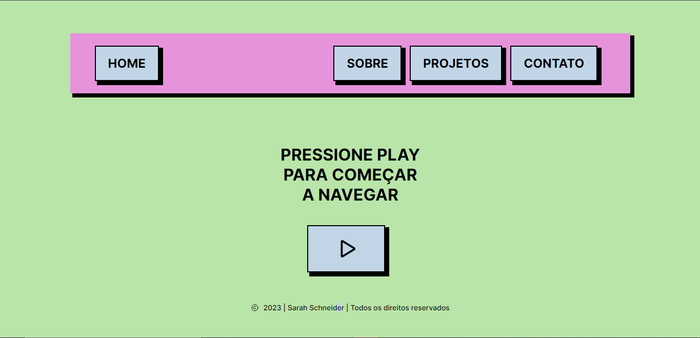

# Portfólio

Meu portfólio pessoal, com todo o design e código criados por mim. Esse projeto tem o objetivo de demonstrar quem sou eu, exibir alguns projetos e modos de entrar em contato comigo.

Ele é uma Single Page Application (SPA), com navegação facilitada entre as páginas, altamente interativo e completamente responsivo. Além disso, sempre estou atualizando e adicionando novas features.

Todos são bem-vindos para fazer um fork do repositório e customizá-lo de acordo com seu gosto pessoal, só peço que me dêem os créditos necesários linkando <a href="https://github.com/ssschneider">meu Github</a>!



## 🔧 Tecnologias

- Typescript
- TSX
- React
- Styled-Components
- ViteJS
- React Router Dom
- Vercel

## 🔗 Acesso

Para acessar o meu portfólio, basta <a href="#">clicar aqui </a>!

## 💻 Demo

| Versão Desktop  | Versão Mobile |
| -------------- |-------------- |
|  |  |

## 🛠 Baixando e Personalizando

Para baixar e personalizar esse repositório, você vai precisar do NodeJS, npm e um editor de código (como o VS Code) instalado.

1. Clone o repositório
    ```
    git clone https://github.com/ssschneider/portfolio.git
    ```

2. Baixe as dependências
    ```
    npm install
    ```

3. Rode o projeto no seu navegador
    ```
    npm run dev
    ```

4. Personalize!
    - Abra o arquivo "globalStyles.tsx", que está dentro da pasta src
    - Altere as variáveis desejadas dentro do ```:root```

